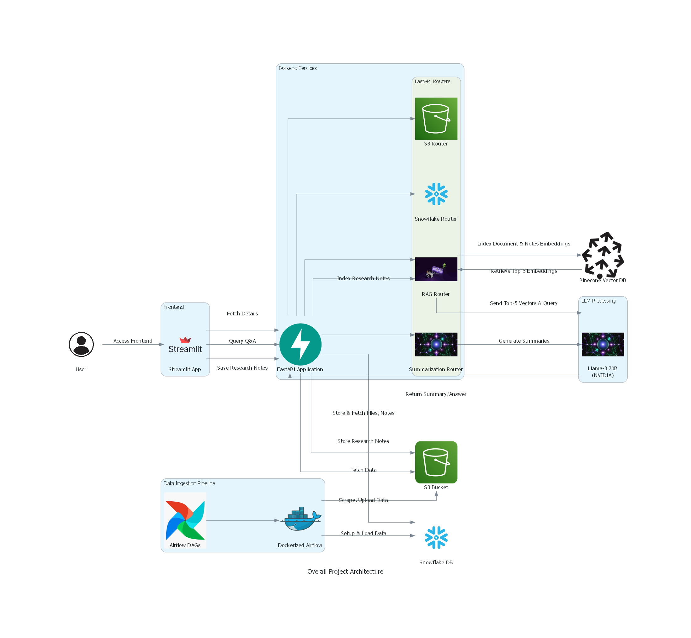
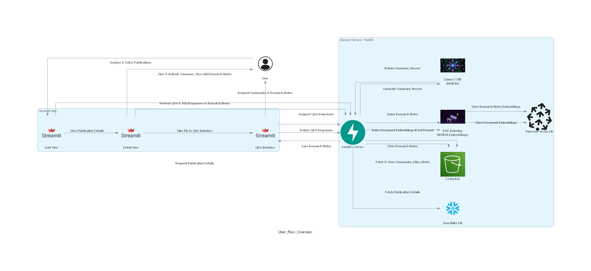
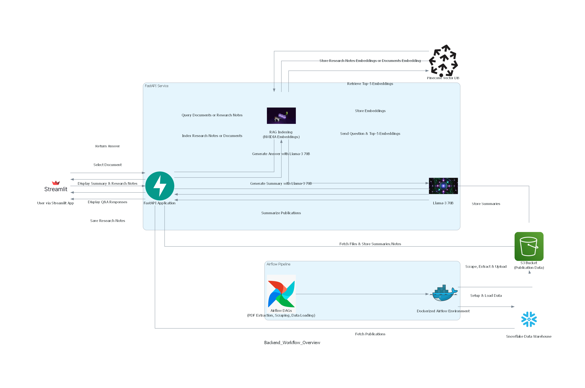

# NVIDIA-MultimodalResearchAssistant
 

## Table of Contents
1. [Introduction](#introduction) 
2. [Key Features](#key-features)  
3. [Project Structure](#project-structure)  
4. [Installation](#installation)  
5. [Folder Documentation](#folder-documentation)  
6. [Usage](#usage)
7. [Attestation](#attestation)  
8. [License](#license) 

**Structural Diagram**:


**User Flow Diagram**:


**Backend Workflow Diagram**:
 

## Introduction
The **NVIDIA-MultimodalResearchAssistant** project is designed to facilitate document exploration, summarization, and question-answering using state-of-the-art AI models. It leverages multi-modal retrieval-augmented generation (RAG) techniques using NVIDIA’s large language models, integrated with a robust data pipeline and document management system. The core of this project revolves around automating the ingestion, processing, and querying of research documents from the CFA Institute Research Foundation Publications. With a streamlined frontend powered by Streamlit and a backend built with FastAPI, users can seamlessly explore documents, generate concise summaries, and interact with the data through an intelligent Q/A interface.

## Key Features
- **Automated PDF Processing**: Extracts text from PDFs and stores them in S3, enabling easy and secure access to publication content.  
- **AI-Powered Summarization**: Generates concise and clear summaries for publications using NVIDIA’s LLM models, providing key insights and essential information at a glance.  
- **Interactive Document Exploration**: Offers a user-friendly Streamlit interface for browsing, selecting, and exploring publications with detailed views.  
- **Data Storage & Management**: Integrates with Snowflake to store and manage publication metadata, including links to publication files and images in S3.  
- **Multi-Modal Retrieval-Augmented Generation (RAG)**: Uses NVIDIA’s multi-modal RAG model for document interaction and querying, powered by Pinecone as the vector database, allowing efficient exploration and dynamic Q&A sessions.  
- **Research Notes & Incremental Indexing**: Facilitates taking and saving research notes, which are indexed separately for each document in Pinecone. Users can also query the indexed research notes, ensuring continuous learning and easy retrieval of key insights.
  

## Project Structure

📦 NVIDIA-MultimodalResearchAssistant  
├── airflow_docker_pipelines  
│   ├── Dockerfile  
│   ├── docker-compose.yml  
│   ├── pdf_extraction_dag.py  
│   ├── scrape_cfa_publications_dag.py  
│   ├── snowflake_load_dag.py  
│   ├── snowflake_setup_dag.py  
│  
├── backend  
│   ├── fast_api  
│   │   ├── fastapi_main.py  
│   │   ├── routers  
│   │   │   ├── rag_router.py  
│   │   │   ├── s3_router.py  
│   │   │   ├── snowflake_router.py  
│   │   │   ├── summarization_router.py  
│   │   └── Dockerfile  
│   ├── utils  
│   │   ├── helper_functions.py  
│   │   └── pdf_processor.py  
│   ├── requirements.txt  
│  
├── frontend  
│   ├── app.py  
│   ├── streamlit_pages  
│   │   ├── detail_view.py  
│   │   ├── grid_view.py  
│   │   ├── qa_interface.py  
│   ├── utils.py  
│   ├── Dockerfile  
│   ├── requirements.txt  
│   ├── no-image-placeholder.png  
│  
├── .env  
├── LICENSE  

## Folder Documentation
- **[Airflow Docker Pipeline](./airflow_docker_pipelines/README.md)**: Contains Airflow DAGs and scripts for automating PDF processing workflows.  
  - **[pdf_extraction_dag.py](./airflow_docker_pipelines/dags/pdf_extraction_dag.py)**: Extracts text from PDFs and uploads them to an S3 bucket using PyMuPDF.  
  - **[scrape_cfa_publications_dag.py](./airflow_docker_pipelines/dags/scrape_cfa_publications_dag.py)**: Scrapes CFA publications, stores data in S3, and saves publication metadata in a CSV file.  
  - **[snowflake_setup_dag.py](./airflow_docker_pipelines/dags/snowflake_setup_dag.py)**: Sets up the Snowflake infrastructure including a warehouse, database, schema, and table.  
  - **[snowflake_load_dag.py](./airflow_docker_pipelines/dags/snowflake_load_dag.py)**: Loads publication data from the CSV in S3 to Snowflake using a merge operation.  

- **[Backend](./backend/README.md)**: Includes FastAPI backend services, routers, and utilities for S3, Snowflake, and NVIDIA API integration.  
  - **[fast_api](./backend/fast_api/README.md)**: Main FastAPI application with routers for document exploration, summarization, research notes, and S3 interactions.  
    - **[rag_router.py](./backend/fast_api/routers/rag_router.py)**: Router for indexing and querying documents using multi-modal RAG and Pinecone.  
    - **[s3_router.py](./backend/fast_api/routers/s3_router.py)**: Router for fetching images, PDFs, summaries, and saving research notes to S3.  
    - **[snowflake_router.py](./backend/fast_api/routers/snowflake_router.py)**: Router for fetching publication data from Snowflake.  
    - **[summarization_router.py](./backend/fast_api/routers/summarization_router.py)**: Router for generating concise summaries of publications using NVIDIA’s AI models.  
  - **[utils](./backend/utils/README.md)**: Utility functions for processing PDFs, managing S3 interactions, and handling various helper operations.  

- **[Frontend](./frontend/README.md)**: Contains the Streamlit application for user interaction and document exploration.  
  - **[streamlit_pages](./frontend/streamlit_pages/README.md)**: Pages for grid view, detailed view, and Q/A interface within the Streamlit app.  
    - **[detail_view.py](./frontend/streamlit_pages/detail_view.py)**: Displays detailed information about selected publications with options for refreshing summaries and viewing research notes.  
    - **[grid_view.py](./frontend/streamlit_pages/grid_view.py)**: Displays a grid of available publications with clickable images for easy navigation.  
    - **[qa_interface.py](./frontend/streamlit_pages/qa_interface.py)**: Provides a Q/A interface for interacting with publications using the multi-modal RAG model.  
  - **[utils.py](./frontend/utils.py)**: Contains utility functions to interact with the backend API, handle session state, fetch images, summaries, research notes, and manage the Q/A interface.
  

## Installation
### Prerequisites
- **Docker & Docker Compose**: Required for containerizing and deploying the application.  
- **Python 3.11**: Ensure you have the correct version of Python installed.  
- **AWS Account**: For storing files and extracted data in S3.  
- **Snowflake Account**: For storing and managing publication metadata.  
- **NVIDIA API Key**: Required for generating summaries and other AI-powered tasks using NVIDIA’s services.  
- **Pinecone Account and API Key**: For storing and querying vector embeddings.  
- **Poetry**: A dependency management tool. You can use Poetry to install dependencies and run the frontend and backend individually for local development without Docker. Poetry will handle all the project dependencies, making it easier to develop and debug separately.

### Step-by-Step Setup
1. **Clone the Repository**:
```bash
   git clone https://github.com/YourRepo/NVIDIA-MultimodalResearchAssistant.git  
   cd NVIDIA-MultimodalResearchAssistant  
```

2. **Setup Environment Variables**:  
   Create an `.env` file in the root directory and add your credentials:  
   AWS_ACCESS_KEY_ID='your-access-key-id'  
   AWS_SECRET_ACCESS_KEY='your-secret-access-key'  
   AWS_REGION='your-aws-region'  
   S3_BUCKET_NAME='your-s3-bucket-name'  
   SNOWFLAKE_ACCOUNT='your-snowflake-account'  
   SNOWFLAKE_USER='your-snowflake-user'  
   SNOWFLAKE_PASSWORD='your-snowflake-password'  
   SNOWFLAKE_ROLE='your-snowflake-role'  
   NVIDIA_API_KEY='your-nvidia-api-key'  
   PINECONE_API_KEY='your-pinecone-api-key'  
   FASTAPI_URL='http://localhost:8000'  

3. **Initialize Airflow and Build Airflow Docker Image**:  
```bash
   cd airflow_docker_pipeline  
   docker build -t airflow-scrape:latest .  
   AIRFLOW_IMAGE_NAME=airflow-scrape:latest AIRFLOW_UID=0 _AIRFLOW_WWW_USER_USERNAME=admin _AIRFLOW_WWW_USER_PASSWORD=admin123 AWS_ACCESS_KEY_ID='your-access-key-id' AWS_SECRET_ACCESS_KEY='your-secret-access-key' AWS_REGION='your-aws-region' S3_BUCKET_NAME='your-s3-bucket-name' SNOWFLAKE_ACCOUNT='your-snowflake-account' SNOWFLAKE_USER='your-snowflake-user' SNOWFLAKE_PASSWORD='your-snowflake-password' SNOWFLAKE_ROLE='your-snowflake-role' docker-compose up airflow-init  
```

4. **Run the Airflow Pipelines in the Correct Sequence**: 
 
- **Scrape CFA Publications**:  
```bash
     AIRFLOW_IMAGE_NAME=airflow-scrape:latest AIRFLOW_UID=0 _AIRFLOW_WWW_USER_USERNAME=admin _AIRFLOW_WWW_USER_PASSWORD=admin123 AWS_ACCESS_KEY_ID='your-access-key-id' AWS_SECRET_ACCESS_KEY='your-secret-access-key' AWS_REGION='your-aws-region' S3_BUCKET_NAME='your-s3-bucket-name' SNOWFLAKE_ACCOUNT='your-snowflake-account' SNOWFLAKE_USER='your-snowflake-user' SNOWFLAKE_PASSWORD='your-snowflake-password' SNOWFLAKE_ROLE='your-snowflake-role' docker-compose run airflow-cli dags trigger scrape_cfa_publications_dag  
```

- **Setup Snowflake**:  
```bash
     AIRFLOW_IMAGE_NAME=airflow-scrape:latest AIRFLOW_UID=0 _AIRFLOW_WWW_USER_USERNAME=admin _AIRFLOW_WWW_USER_PASSWORD=admin123 AWS_ACCESS_KEY_ID='your-access-key-id' AWS_SECRET_ACCESS_KEY='your-secret-access-key' AWS_REGION='your-aws-region' S3_BUCKET_NAME='your-s3-bucket-name' SNOWFLAKE_ACCOUNT='your-snowflake-account' SNOWFLAKE_USER='your-snowflake-user' SNOWFLAKE_PASSWORD='your-snowflake-password' SNOWFLAKE_ROLE='your-snowflake-role' docker-compose run airflow-cli dags trigger snowflake_setup_dag  
```

- **Load Data into Snowflake**:  
```bash
     AIRFLOW_IMAGE_NAME=airflow-scrape:latest AIRFLOW_UID=0 _AIRFLOW_WWW_USER_USERNAME=admin _AIRFLOW_WWW_USER_PASSWORD=admin123 AWS_ACCESS_KEY_ID='your-access-key-id' AWS_SECRET_ACCESS_KEY='your-secret-access-key' AWS_REGION='your-aws-region' S3_BUCKET_NAME='your-s3-bucket-name' SNOWFLAKE_ACCOUNT='your-snowflake-account' SNOWFLAKE_USER='your-snowflake-user' SNOWFLAKE_PASSWORD='your-snowflake-password' SNOWFLAKE_ROLE='your-snowflake-role' docker-compose run airflow-cli dags trigger snowflake_load_dag  
```

- **Extract PDF Summarization**:  
```bash
     AIRFLOW_IMAGE_NAME=airflow-scrape:latest AIRFLOW_UID=0 _AIRFLOW_WWW_USER_USERNAME=admin _AIRFLOW_WWW_USER_PASSWORD=admin123 AWS_ACCESS_KEY_ID='your-access-key-id' AWS_SECRET_ACCESS_KEY='your-secret-access-key' AWS_REGION='your-aws-region' S3_BUCKET_NAME='your-s3-bucket-name' SNOWFLAKE_ACCOUNT='your-snowflake-account' SNOWFLAKE_USER='your-snowflake-user' SNOWFLAKE_PASSWORD='your-snowflake-password' SNOWFLAKE_ROLE='your-snowflake-role' docker-compose run airflow-cli dags trigger pdf_extraction_dag  
```

5. **Build and Start the Docker Containers for Backend and Frontend**:  
```bash
   cd ../  
   docker-compose up --build  
```
   This command will start both the FastAPI service on `http://localhost:8000` and the Streamlit app on `http://localhost:8501`.  

### Usage

Once the application is up and running, you can access it at `http://localhost:8501`. Here are the main features accessible through the Streamlit interface:

1. **Document Exploration**:
   - Explore documents using a grid view of publication covers. You can select any publication to view its details.
   - On selecting a publication, you are taken to the detail view, where you can see key details such as the author, date published, and a brief summary.
   - The summary is automatically generated using NVIDIA's LLM model.

2. **Research Notes and Q/A Interface**:
   - Within the detail view, you can view or add research notes for each publication. Research notes can be saved for future reference.
   - There is an option to navigate to the Q/A Interface, where you can interact with the selected document using a Question/Answer system.
   - The Q/A Interface utilizes a Multi-Modal RAG (Retrieval-Augmented Generation) model powered by NVIDIA, and uses Pinecone as the vector database.
   - You can query the document or the research notes separately, as the research notes are also indexed within Pinecone.
   - Answers from the Q/A interaction can be saved directly into the research notes for that publication.


### License

This project is licensed under the MIT License. For more details, please refer to the [LICENSE](LICENSE) file.
